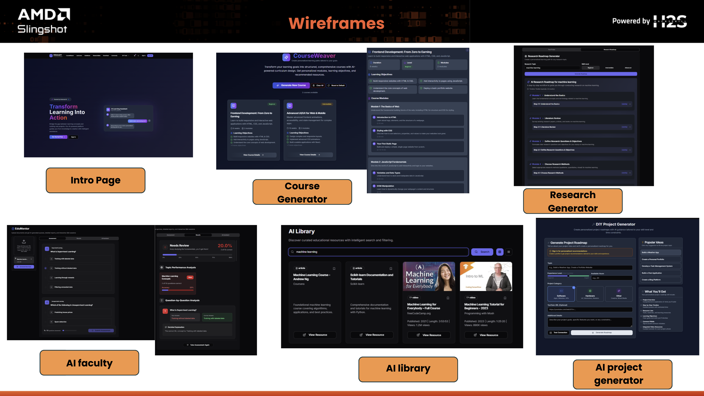

# 🌟 ShikshaShakti - AI-Powered Adaptive Skilling Platform for Bharat  

ShikshaShakti is an AI-driven adaptive learning platform designed to bridge the gap between education and employability. It combines cognitive learner modeling, explainable generative AI tutoring, and industry-aligned skill intelligence within a scalable edge-to-cloud architecture powered by AMD compute.

---

# 🚀 Problem Statement

Traditional education systems are:

- One-size-fits-all  
- Not aligned with real-time industry demand  
- Focused on completion, not mastery  
- Weak in personalization and retention tracking  
- Limited in multilingual accessibility  

AI tools often provide direct answers but fail to build conceptual understanding or track long-term mastery.

---

# 💡 Our Solution

ShikshaShakti is a **closed-loop adaptive learning system** that:

- Diagnoses learner skill gaps  
- Generates prerequisite-aware personalized roadmaps  
- Delivers stepwise, explainable AI tutoring  
- Tracks mastery & retention over time  
- Aligns skills directly with job-market demand  

Every learner interaction updates the system’s cognitive model, enabling dynamic curriculum recalibration.

---

# 🖼 Platform UI Preview



---

# 🧠 Core Features

## 🎓 AI Learning Profiler
- Adaptive diagnostic assessment  
- Skill vector generation (IRT + Bayesian tracking)  
- Confidence calibration  

## 🗺 Curriculum Planning Engine
- Knowledge graph traversal  
- Goal-based roadmap generation  
- Dynamic difficulty adjustment  

## 💬 Explainable AI Tutor
- Multi-agent reasoning pipeline  
- RAG-based knowledge retrieval  
- Stepwise hints instead of answer dumping  
- Error classification  

## 🧠 Mastery & Retention Engine
- SM-2 spaced repetition  
- Memory decay modeling  
- Mastery score (0–100)  
- Exam readiness index  

## 💼 Career Intelligence Engine
- Resume parsing  
- Skill-gap detection  
- Job-role semantic matching  
- Mock interview simulation  

## 🌍 Multilingual Voice Support
- Speech-to-text & text-to-speech  
- Regional language support  
- Low-bandwidth optimization  


---

# ⚙ Technology Stack

## Frontend
- Next.js (TypeScript)
- React
- Tailwind CSS
- Web Speech API

## Backend
- FastAPI (Python)
- REST APIs
- JWT Authentication

## AI & ML
- Llama / Qwen LLMs
- LangGraph (Multi-Agent Orchestration)
- Retrieval-Augmented Generation (RAG)
- Sentence Transformers (Embeddings)
- Item Response Theory (IRT)
- Bayesian Knowledge Tracing
- SM-2 Spaced Repetition

## Databases
- MongoDB
- Redis
- ChromaDB / FAISS (Vector Search)

## Infrastructure
- Dockerized Microservices

---

# 🚀 AMD Hardware Acceleration

ShikshaShakti leverages AMD’s edge-to-cloud compute stack:

## 🖥 Ryzen™ AI (Edge)
- Real-time tutoring inference  
- Voice processing  
- Low-latency interaction  

## 🎮 Radeon™ GPUs
- LLM acceleration  
- RAG processing  
- Embedding generation via ROCm  

## 🏢 EPYC™ Processors
- Multi-user backend scaling  
- Career analytics engine  

---

# 📊 Impact

- Personalized learning at scale  
- Improved retention & reduced dropout  
- Industry-aligned skill development  
- Inclusive multilingual access  
- Cost-efficient AI deployment  

---

# 📂 Project Structure


AMD-hack-2026/
│
├── backend/ # FastAPI backend + AI services
├── frontend/ # Learner-facing Next.js app
│ └── src/ # UI images (UI.png)
├── frontend-admin/ # Admin dashboard
├── .gitignore
└── README.md


---
# 🛠 Getting Started

## 🔹 Backend

```bash
cd backend
pip install -r requirements.txt
uvicorn main:app --reload
```

## 🔹 Frontend

```bash
cd frontend
npm install
npm run dev
```

## 🔹 Admin Panel

```bash
cd frontend-admin
npm install
npm run dev
```

---

# 🔮 Future Enhancements

- Federated learning for privacy-preserving adaptation  
- AI-driven emotional engagement detection  
- Real-time industry skill demand scraping  
- National-scale deployment architecture  

---
Thank YOU